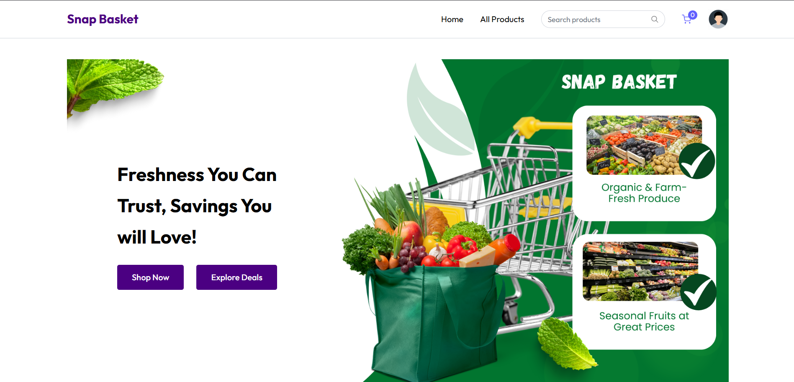
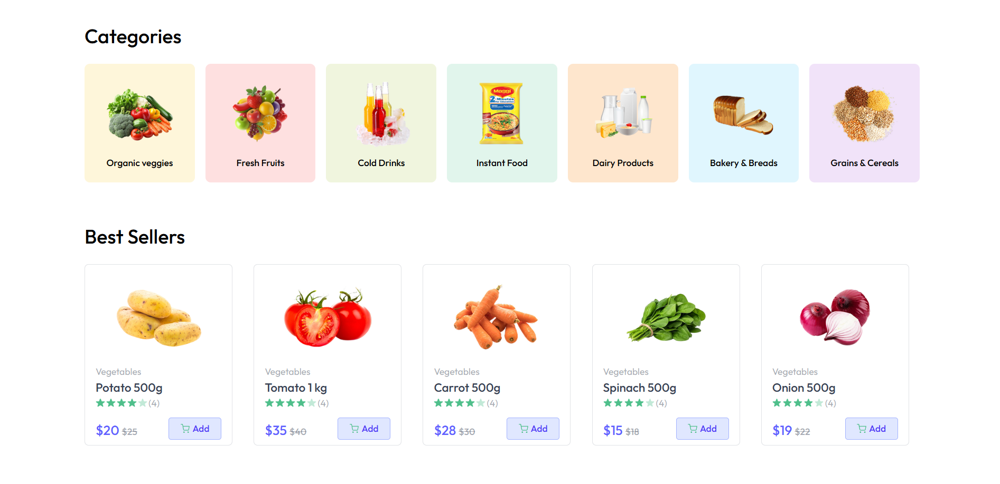
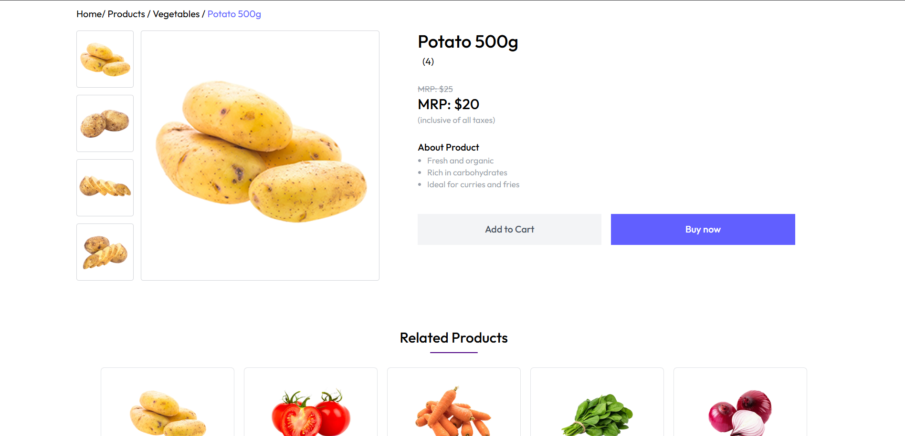
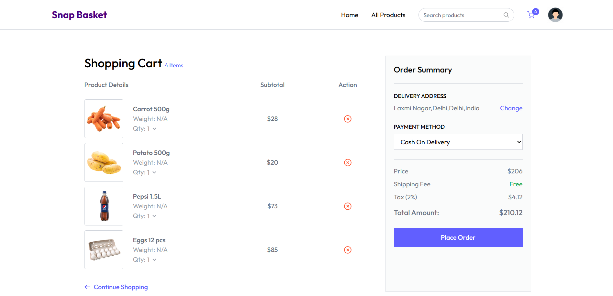
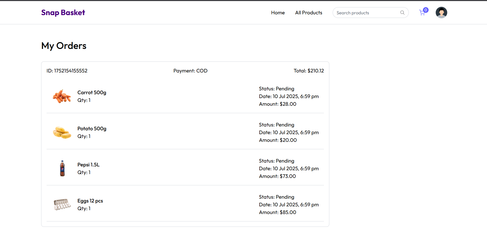

# 🛒 Snap Bucket

A full-stack grocery e-commerce web application built with the MERN stack. Snap Bucket provides product browsing, search, cart management, authentication, address management, and order placement through a responsive web interface.

## 🌟 Features

- **Modern UI/UX** – Responsive grocery shopping interface
- **Product Catalog** – Browse products across multiple categories
- **Search** – Search products quickly
- **Shopping Cart** – Add, remove, and update cart items
- **User Authentication** – JWT-based authentication
- **Product Categories** – Browse products by category
- **Address Management** – Add delivery addresses before placing orders
- **Order Management** – View previously placed orders
- **Payment Integration** – Stripe payment integration
- **Image Management** – Cloudinary integration for product images

## 🖥️ Screenshots

### Home Page


### All Products


### Product Page


### Cart


### Orders


## 🚀 Live Demo

[https://snap-bucket-client.onrender.com](https://snap-bucket-client.onrender.com)

## 🛠️ Tech Stack

### Frontend

- React
- Vite
- JavaScript / ES6+
- Tailwind CSS
- React Router
- Axios

### Backend

- Node.js
- Express.js
- MongoDB Atlas
- Mongoose
- JWT Authentication
- Stripe
- Cloudinary

### Deployment & DevOps

- Docker
- Docker Compose
- Nginx
- Render
- MongoDB Atlas

## 📁 Project Structure

```text
snap-Bucket/
├── backend/
│   ├── controllers/
│   ├── middleware/
│   ├── models/
│   ├── routes/
│   ├── uploads/
│   ├── index.js
│   ├── package.json
│   ├── Dockerfile
│   └── .dockerignore
│
├── client/
│   ├── public/
│   ├── src/
│   │   ├── components/
│   │   ├── pages/
│   │   ├── services/
│   │   ├── utils/
│   │   ├── App.jsx
│   │   └── main.jsx
│   ├── package.json
│   ├── Dockerfile
│   ├── nginx.conf
│   └── .dockerignore
│
├── docker-compose.yml
├── .gitignore
└── README.md